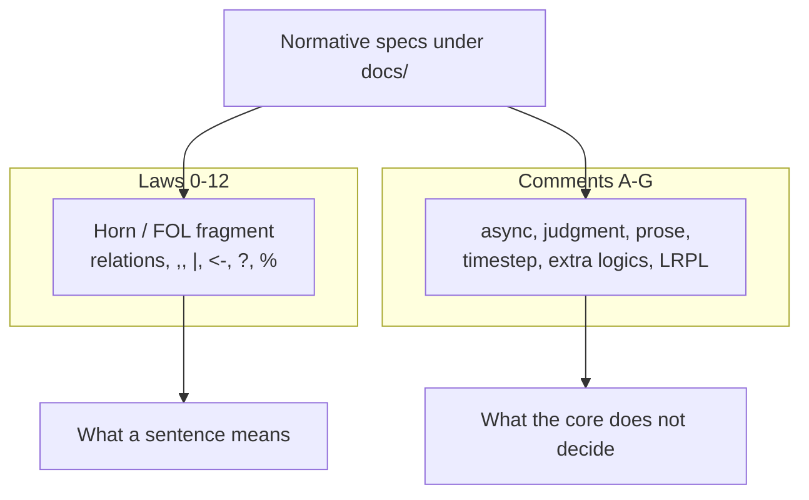

# Language Bootstrap — RPL as a Logic

This document introduces **the language**. It does not introduce an agent's habits.

It is the language bootstrap: an axiomatic reading of core (L)RPL, derived from the normative specifications. Comments mark everything that is not a theorem of that core.

## Authority

Only documents under `docs/` define the language.

- **Normative:** [specification/rpl.md](specification/rpl.md), and [specification/lrpl.md](specification/lrpl.md) where a host adopts the lazy delta.
- **Optional logics:** [specification/logics.md](specification/logics.md). They are extensions, not part of the core fragment below.
- **Grounding:** [theory.md](theory.md), [motivation.md](motivation.md), [vision.md](vision.md), [scope.md](scope.md).

If this primer and a normative section disagree, the specification wins. This file is a reading of those documents, not a second spec.

Treat trees outside `docs/` (composed prompts, translation guides, tests, skills) as non-authoritative. They may describe an earlier RPL.

[bootstrapping.md](bootstrapping.md) is a sketch of *agent* pedagogy. Do not use it as a definition of the language. It is incomplete and should not be treated as a source for these laws.

---

## What this bootstrap is

RPL is a logic that happens to be written in Markdown.

The useful bootstrap for the language is therefore the same move as a logic text, or as *The Little Lisper* / *The Reasoned Schemer* applied to a logic rather than to a Lisp: start from a small formal core, add one connective at a time, and put the fuzzy remainder in comments.

Two layers, from [theory.md](theory.md):

```
Formal layer     rules, constraints, abductives, quiescence, dispatch
Agent layer      interpretation, ambiguity, non-monotonic change, planning,
                 error recovery
```



Laws below are the formal layer. Comments are the agent layer, plus host and surface concerns the core does not decide.

The formal core is **not** full classical first-order logic. It is the **definite Horn / Datalog-shaped fragment** that the base spec actually writes: named predicates, terms, conjunction, disjunction, backward implication, and the usual quantifier reading of rule and query variables. That is first-order logic, restricted. Full FOL (arbitrary quantifier prefixes, function-term construction as a primary syntax, classical completeness) is more than the language commits to.

---

## How to read a law

Each law has:

| Field | Role |
| --- | --- |
| **Law** | The claim. |
| **FOL reading** | The first-order meaning, or *comment* if there is none. |
| **Surface** | The RPL spelling. |
| **Spec** | The owning section. |
| **Example** | One small witness. |
| **Not** | A nearby misreading. |

A **comment** is not a weaker law. It is a refusal to pretend the claim is a theorem.

---

## The formal fragment

### Law 0 — Truth values exist

**Law.** `true` and `false` are literals and may stand as the right-hand side of an invariant.

**FOL reading.** ⊤ and ⊥.

**Surface.** `true`, `false`.

**Spec.** [rpl.md §2](specification/rpl.md#2-literals), [rpl.md §12.1](specification/rpl.md#121-constraint-syntax).

**Example.**

```rpl
rel(?x) -> true
rel1(?x), rel2(?x) -> false
```

**Not.** `true` is not a command. It is a truth value.

---

### Law 1 — A relation is an atomic formula

**Law.** A relation names a fact. It is a label applied to arguments.

**FOL reading.** An atomic formula P(t₁, …, tₙ). The label is the predicate. The arguments are terms.

**Surface.** `LABEL '(' ARG,* ')'`.

**Spec.** [rpl.md §9](specification/rpl.md#9-relations).

**Example.**

```rpl
ancestor(?x, ?y)
locked-ingredient-line($ingredient, $qtyNote)
```

**Not.** A relation is not an action. `collect-name(?first, ?last)` is the wrong shape; `name(?first, ?last)` is the right one.

---

### Law 2 — Conjunction

**Law.** A comma joins claims that must hold together.

**FOL reading.** ∧.

**Surface.** `A , B`.

**Spec.** [rpl.md §5.5](specification/rpl.md#55-logical-operators), [rpl.md §10](specification/rpl.md#10-rules-and-implication).

**Example.**

```rpl
parent(?x, ?y), ancestor(?y, ?z)
```

**Not.** Comma is not sequencing. Order of conjuncts is not a control-flow order.

---

### Law 3 — Disjunction

**Law.** A bar joins alternative claims.

**FOL reading.** ∨.

**Surface.** `A | B`.

**Spec.** [rpl.md §5.5](specification/rpl.md#55-logical-operators), [rpl.md §10](specification/rpl.md#10-rules-and-implication).

**Example.**

```rpl
% <- %needs-discovery | %needs-edit
```

**Not.** Disjunction is not “the agent picks a vibe.” It is a logical alternative. Which eligible alternative is tried first, when several remain, is a comment (syntactic order among eligible rules, [rpl.md §18](specification/rpl.md#18-runtime--operating-model), [vision.md](vision.md#design-principles)).

---

### Law 3a — Negation is written, not classified

**Law.** `not A` is a well-formed operator on a formula.

**FOL reading.** *Comment.* [rpl.md §5.5](specification/rpl.md#55-logical-operators) lists `not`. It does not say whether that is classical ¬ or failure to prove. Do not treat it as classical FOL negation until a normative section does.

**Surface.** `not A`.

**Spec.** [rpl.md §5.5](specification/rpl.md#55-logical-operators).

**Example.**

```rpl
discount(?user, 5) <- not premium-member(?user)
```

**Not.** A missing fact is not automatically a proof of `not P`. That leap is agent judgment unless the host defines a closed world.

---

### Law 4 — Horn implication

**Law.** `HEAD <- BODY` means: the head holds when the body holds.

**FOL reading.** A definite clause. Rule variables are universally quantified:

∀x⃗ (BODY(x⃗) → HEAD(x⃗))

**Surface.** `HEAD <- EXPR`.

**Spec.** [rpl.md §10](specification/rpl.md#10-rules-and-implication).

**Example.**

```rpl
ancestor(?x, ?y) <- parent(?x, ?y)
ancestor(?x, ?z) <- parent(?x, ?y), ancestor(?y, ?z)
```

**Not.** `<-` is not a procedure call. It does not say “run BODY, then do HEAD.” It states a dependency.

`<=` is comparison, not implication ([rpl.md §5.1](specification/rpl.md#51-comparison-and-arithmetic)).

---

### Law 5 — Invariant implication

**Law.** `LEFT -> RIGHT` is an invariant: under the left-hand conditions, the right-hand side must hold.

**FOL reading.** A constraint, not a clause used to derive new heads. Read it as an obligation: LEFT ⊨ RIGHT, checked rather than used as a generator.

**Surface.** `… -> CONSTRAINT`.

**Spec.** [rpl.md §12](specification/rpl.md#12-constraints-and-tracing).

**Example.**

```rpl
edit-brief(?d, ?g), editing-goal(?g) -> valid-editing-goal(?g)
```

**Not.** `->` is not the `%` namespace. A **goal atom** is a head in `%` (Law 9). An **invariant** is `->`. [logics.md](specification/logics.md) sometimes calls `->` “Goals” in the fact/proof sense. That is the invariant connective. It is not `%`.

---

### Law 6 — Assertion and proof together

**Law.** A standalone expression is shorthand for a two-sided commitment: it is asserted, and it is required to hold.

**FOL reading.** Existence of the fact, plus the obligation that it is true. [logics.md §1](specification/logics.md#11-the-canonical-form):

```
true <- expr -> true
```

**Surface.** A bare `expr` in a program.

**Spec.** [logics.md §1](specification/logics.md#1-motivation-and-base-logic), [rpl.md §10](specification/rpl.md#10-rules-and-implication) (a sentence may be a tail only).

**Example.**

```rpl
names-workflow-phase("explore")
```

is the existence of that fact and the claim that it holds.

**Not.** A fact without an invariant is a floating possibility. A proof without a head has no subject. The core language keeps them together unless an additional logic splits them ([logics.md](specification/logics.md)).

---

### Law 7 — Logical variables

**Law.** `?name` is a logical variable. `_` matches anything and binds nothing.

**FOL reading.** In a **rule** (Law 4), free lvars are the universal variables of the clause. In a **goal** (Law 9), unbound lvars are existential: the goal asks for a witness.

Two readings of one binding ([rpl.md §3](specification/rpl.md#3-variables)):

- `?x` — the **value** of the bound expression.
- `#?x` — the **syntax** of that expression (expansion).

**Surface.** `?name`, `_`, `#?x`.

**Spec.** [rpl.md §3](specification/rpl.md#3-variables), [rpl.md §5.7](specification/rpl.md#57-expansion).

**Example.**

```rpl
outer(?r, ?y) <- ... -> ?r -> inner(?x)
```

**Not.** `?q(?a)` is ill-formed. The callee must be a label, not an lvar.

---

### Law 8 — Equality and matching

**Law.** `=` is equality. Structural matching is `~ PATTERN`.

**FOL reading.** `=` is identity of values. `~` is unification against a pattern form (collections, templates, regex). Matching is not a separate FOL connective; it is how terms are identified.

**Surface.** `?x = ?y`, `?x = ~ PATTERN`, `?x != ?y`.

**Spec.** [rpl.md §5.1](specification/rpl.md#51-comparison-and-arithmetic), [rpl.md §6](specification/rpl.md#6-in-place-matching).

**Example.**

```rpl
?x = ~ {:key ?val}
?s ~ /chest pain/
```

**Not.** Bare `=` does not perform structural matching. Use `~`.

---

### Law 9 — A goal is an existential problem

**Law.** A goal is a rule whose head is in the `%` namespace. Goals drive what is to be solved for.

**FOL reading.** A query. Unbound arguments are existential:

∃x⃗ BODY(x⃗)

The unnamed `%` is the root query. Several `%` rules disjoin (Law 3).

**Surface.** `% <- tail`, `%name <- tail`, `%name(?a, ?b) <- tail`.

**Spec.** [rpl.md §15](specification/rpl.md#15-goals).

**Example.**

```rpl
% <- %needs-discovery | %needs-edit
%needs-edit(?d) <- edit-brief(?d, ?g), ?g != "unknown"
```

**Not.** A goal is not an imperative script. It names what must be witnessed.

**Comment.** If there is no root `%`, which named goal is attempted is agent judgment ([rpl.md §15.3](specification/rpl.md#153-named-goals-and-agent-choice)). That choice is not a theorem.

---

### Law 10 — A grounded invariant is a trace

**Law.** An ungrounded constraint is a live check. Once every variable is bound, the same constraint is a trace. Traces are queryable as ordinary relations.

**FOL reading.** A closed sentence, recorded. The trace is the ground theory accumulated so far.

**Surface.** `… ^^ {…} -> true`, retraction `… -> false`.

**Spec.** [rpl.md §12.2–12.5](specification/rpl.md#122-constraint-grounding), [vision.md](vision.md#the-trace), [theory.md](theory.md).

**Example.**

```rpl
editing-goal(?g) ^^ {?g "publish", ?d "draft-0"} -> true
```

**Not.** The trace is not a debug log you may ignore. Later strata start from it.

**Comment.** Retraction (`-> false`) is non-monotonic. It is a coordination point. Agent judgment is required ([theory.md](theory.md#bloom-calm-and-monotonicity-rpl)).

---

### Law 11 — Three namespaces, one grammar

**Law.** Relations, goals, and tools are syntactically distinct and uniform under the rule grammar.

**FOL reading.** *Partial.* Relations are predicates. Goals are queries (Law 9). Tools are **oracles**: they are not theorems of the core theory. They produce ground facts from outside it.

**Surface.** `rel(…)`, `%goal(…)`, `$tool(…)`.

**Spec.** [rpl.md §1](specification/rpl.md#1-overview), [rpl.md §9](specification/rpl.md#9-relations), [rpl.md §14](specification/rpl.md#14-tools), [rpl.md §15](specification/rpl.md#15-goals).

**Example.**

```rpl
ask(?prompt, ?answer) <- $ask(?prompt) ^ ~ {:result ?answer}
```

**Not.** A tool is not a relation you derive. Hide it behind a relation when you want a stable interface ([rpl.md §13.3](specification/rpl.md#133-resolution-as-grounded-constraint)).

---

### Law 12 — The monotonic core agrees with itself

**Law.** Fact accumulation, rule derivation, and trace growth are monotonic. Any reader of the same facts reaches the same conclusions in that core.

**FOL reading.** The Horn theory is monotonic: adding sentences does not withdraw earlier consequences.

**Surface.** No extra syntax. This is the reading of Laws 1–10 together.

**Spec.** [theory.md](theory.md), Bloom / CALM.

**Example.** A handoff that reloads the same trace re-derives the same relational core.

**Not.** “The model will probably remember.” Continuity is the trace, not the window.

**Comment.** Non-monotonic points — retraction, forced choice, conflict, non-monotonic schema change, lazy entry, forced realisation — are where the language defers to the agent. They are coordination points, not missing axioms.

---

## Comments — not theorems

These are part of RPL as a *framework*. They are not part of the Horn core.

### Comment A — Async variables are temporal connectives

`$x` suspends until a later timestep. `?x` is resolved inside the current deductive step.

There is no FOL connective for “this witness arrives from the user or a tool later.” The spec treats `$` as a Bloom-style asynchronous channel ([rpl.md §13](specification/rpl.md#13-async-variables), [theory.md](theory.md)). When `$x` resolves, the event is recorded as a grounded constraint (Law 10).

Scope uses `$` for **deduced** positions and `?` for **inferred** ones ([scope.md](scope.md#inference-and-deduction)). That role distinction is load-bearing for authors. It is still not a Horn axiom.

### Comment B — Agent judgment is the default remainder

Where the spec is silent, the agent decides ([vision.md](vision.md#design-principles), [scope.md](scope.md#what-rpl-is-not)).

This is deliberate. RPL is a protocol language, not a programming language and not an enforcement sandbox ([README.md](README.md#what-rpl-does-not-do)).

Do not promote judgment rules into laws. If a behaviour must be a law, it belongs in the spec first.

### Comment C — Prose materialises; it does not axiomatise

Markdown headings, emphasis, and fenced `rpl` blocks are how a document *denotes* a program ([rpl.md §17](specification/rpl.md#17-source-format), [motivation.md](motivation.md)).

`__word__` marks a variable site. Heading signatures start a rule. Body prose conjoins.

That is a source-format reading, not a new connective. Two honest proses can materialise to different but eligible programs. Choosing among them is Comment B.

### Comment D — The timestep is a rhythm, not a semantics of `,`

The eight-phase timestep ([rpl.md §18](specification/rpl.md#18-runtime--operating-model)) is how a host may schedule assertion, quiescence, goals, and async dispatch.

It does not redefine conjunction. Read it as an implementation rhythm. The meaning of a sentence is still Laws 1–10.

### Comment E — Additional logics are optional extensions

Existential (`<%`, `%>`), modal (`~>`, `<~`), and interpretive (`<@`, `@>`) operators live in [logics.md](specification/logics.md). Core-conformant RPL does not require them ([rpl.md §1](specification/rpl.md#1-overview)).

When they are adopted, they split Law 6’s two-sided commitment (log vs impulse, consistency vs eventually; necessity vs possibility; language vs interpretation). They do not replace Laws 1–5.

### Comment F — LRPL is a delta on evaluation, not a new core

Lazy expressions, constraint memos, and satisfactory quiescence ([lrpl.md](specification/lrpl.md)) change *when* interior claims count as present and *how much* must be derived for a goal.

Every valid RPL program remains valid under LRPL ([vision.md](vision.md#lrpl--the-lazy-extension)). Teach the core first.

### Comment G — Activation clauses are formal; choosing among them may not be

`; @when`, `@choose`, `@distinct`, `@each`, `@for` are in the formal layer ([theory.md](theory.md#layers-formal-and-agent), [rpl.md §16](specification/rpl.md#16-activation-clause--abductives)).

They control activation. They are not Horn generators. Nested `HEAD <- HEAD <- TAIL` is a permitted idiom, not the execution model ([rpl.md §10](specification/rpl.md#10-rules-and-implication), [vision.md](vision.md#design-principles)).

---

## A first derivation (the ancestry example, as logic)

This is the example [bootstrapping.md](bootstrapping.md) used as agent training. Here it is only a Horn program.

**Facts.**

```rpl
parent("ann", "bob")
parent("bob", "cam")
```

**Theory.**

```rpl
ancestor(?x, ?y) <- parent(?x, ?y)
ancestor(?x, ?z) <- parent(?x, ?y), ancestor(?y, ?z)
```

**Query.**

```rpl
% <- ancestor("ann", ?desc)
```

**FOL reading.** From ∀x∀y (parent(x,y) → ancestor(x,y)) and ∀x∀y∀z (parent(x,y) ∧ ancestor(y,z) → ancestor(x,z)), plus the two ground facts, the query ∃d ancestor(ann, d) has witnesses `bob` and `cam`.

**Comment.** “Trace a path back to the origin of an idea” is an *interpretation* of this program for an agent. It is not a law of the language. The language only says the relation `ancestor` is the transitive closure of `parent`.

---

## What this bootstrap is not

- Not a rewrite of the normative grammar.
- Not a metacognitive kernel ([agent-mck.md](agent-mck.md) is a different document).
- Not a replacement for the recipe tutorial. Tutorials show authoring. This file shows what the notation *means*.
- Not an invitation to encode enterprise runtimes in RPL ([enterprise.md](enterprise.md)).

---

## Related documents

- [specification/rpl.md](specification/rpl.md) — normative core.
- [specification/lrpl.md](specification/lrpl.md) — lazy delta.
- [specification/logics.md](specification/logics.md) — optional additional logics.
- [theory.md](theory.md) — Bloom, CALM, layers.
- [motivation.md](motivation.md) — why the language is shaped this way.
- [README.md](README.md) — worked example and document map.
- [bootstrapping.md](bootstrapping.md) — incomplete agent-habit sketch; not a language source.
