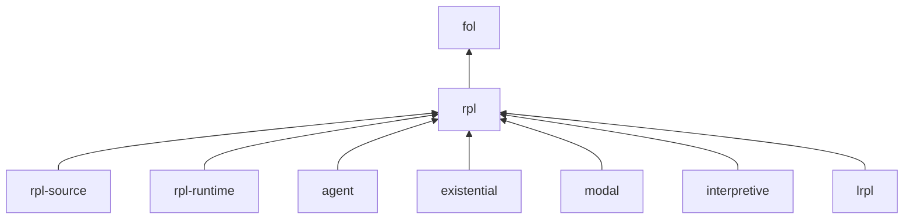

# Language Bootstrap — Layers

This is the **language** bootstrap. It is not an agent-habit sketch.

The language is offered as **named layers**. A layer depends on zero or more other layers and provides one part of the language. You take a layer by taking its **dependency closure**. You do not take comments from a layer you did not take.

## Authority

Only documents under `docs/` define the language.

- **Normative:** [specification/rpl.md](specification/rpl.md), and [specification/lrpl.md](specification/lrpl.md) where a host adopts `lrpl`.
- **Optional logics:** [specification/logics.md](specification/logics.md) — layers `existential`, `modal`, `interpretive`.
- **Grounding:** [theory.md](theory.md), [motivation.md](motivation.md), [vision.md](vision.md), [scope.md](scope.md).

If a layer and a normative section disagree, the specification wins.

Trees outside `docs/` are non-authoritative. [bootstrapping.md](bootstrapping.md) is an incomplete agent sketch. It is not a layer and not a source.

## How to take a layer

1. Choose the named layer you want (`rpl`, `lrpl`, `modal`, …).
2. Include every layer in its **Depends on** list, recursively, until the set is closed.
3. Read only those layer files. Laws in an omitted layer are not in force.

A **law** is a theorem of that layer. A **comment** in a layer is in force when you take the layer, but it is not a theorem.

Each law uses: **Law**, **FOL reading** (or *comment*), **Surface**, **Spec**, **Example**, **Not**.

## Catalog

| Layer | Provides | Depends on | Spec |
| --- | --- | --- | --- |
| [`fol`](bootstrap/fol.md) | Horn / FOL fragment: truth, atoms, `,` `\|` `not`, `<-`, `?x`, `=` | — | [rpl.md](specification/rpl.md) §2, §3, §5.5, §10; [theory.md](theory.md) |
| [`rpl`](bootstrap/rpl.md) | Base RPL: relations, `->`, traces, `%`, `$`, matching, abductives | `fol` | [rpl.md](specification/rpl.md) |
| [`rpl-source`](bootstrap/rpl-source.md) | Markdown source format; prose materialisation | `rpl` | [rpl.md](specification/rpl.md) §17 |
| [`rpl-runtime`](bootstrap/rpl-runtime.md) | Timestep rhythm; RPL shell mode | `rpl` | [rpl.md](specification/rpl.md) §15.9, §18 |
| [`agent`](bootstrap/agent.md) | Judgment remainder; no new syntax | `rpl` | [theory.md](theory.md); [vision.md](vision.md) |
| [`existential`](bootstrap/existential.md) | Lifecycle `<%` `%>` | `rpl` | [logics.md](specification/logics.md) §2 |
| [`modal`](bootstrap/modal.md) | Perspective `~>` `<~` | `rpl` | [logics.md](specification/logics.md) §3 |
| [`interpretive`](bootstrap/interpretive.md) | Languages `<@` `@>` | `rpl` | [logics.md](specification/logics.md) §4 |
| [`lrpl`](bootstrap/lrpl.md) | Lazy evaluation, memos, satisfactory quiescence, lazy stdlib | `rpl` | [lrpl.md](specification/lrpl.md) |



`fol` is not full classical first-order logic. It is the definite Horn / Datalog-shaped fragment the specs write. `not` is spelled in `fol` and not classified there.

## Instantiations

These names are **closures**, not extra layers.

| Instantiation | Take | Meaning |
| --- | --- | --- |
| **RPL** | `rpl-source`, `rpl-runtime`, `agent` | Base language as a Markdown-hosted protocol. Closure is `fol` + `rpl` + those three. |
| **LRPL** | `lrpl` plus the **RPL** set | Every valid RPL program remains valid. Adds lazy forms and goal-relative quiescence. |
| **(L)RPL + logics** | **RPL** or **LRPL**, plus any of `existential`, `modal`, `interpretive` | Additional logics are pairwise independent. Each depends only on `rpl`. |

You may take `rpl` without `rpl-source` if you only care about the logic, not Markdown. You may take `lrpl` without `rpl-source`. You may not take `lrpl` without `rpl`.

## Worked example (instantiation **RPL**)

Needs `fol` + `rpl` (the `%` query).

```rpl
parent("ann", "bob")
parent("bob", "cam")

ancestor(?x, ?y) <- parent(?x, ?y)
ancestor(?x, ?z) <- parent(?x, ?y), ancestor(?y, ?z)

% <- ancestor("ann", ?desc)
```

**FOL reading** (`fol`): ∀-clauses for `ancestor`, two ground facts, query ∃d ancestor(ann, d). Witnesses `bob` and `cam`.

**Not a law:** “Trace a path back to the origin of an idea.” That is an `agent` interpretation of this program.

## What this bootstrap is not

- Not a rewrite of the normative grammar.
- Not a metacognitive kernel ([agent-mck.md](agent-mck.md)).
- Not a replacement for the [tutorial/](tutorial/).
- Not an enterprise runtime ([enterprise.md](enterprise.md)).

## Related documents

- Layer files: [bootstrap/](bootstrap/)
- [specification/rpl.md](specification/rpl.md), [specification/lrpl.md](specification/lrpl.md), [specification/logics.md](specification/logics.md)
- [theory.md](theory.md), [motivation.md](motivation.md), [README.md](README.md)
- [bootstrapping.md](bootstrapping.md) — not a layer
