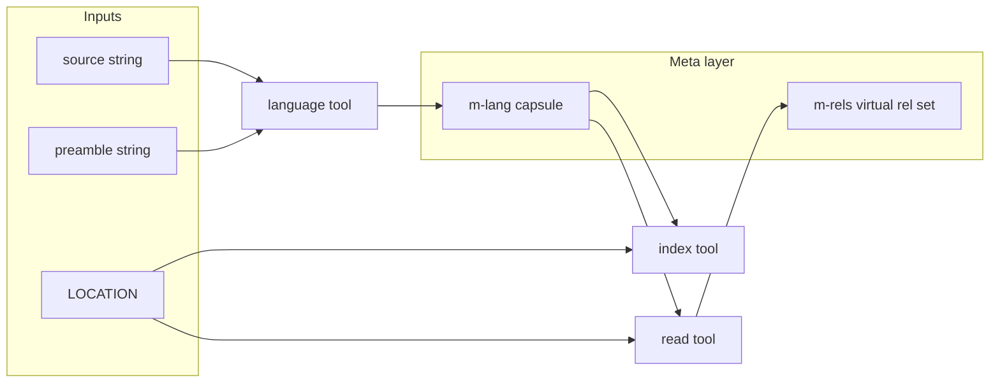

# RPL Meta-Programming Extension — Formal Specification

## 1. Status

This document is an **extension** to RPL ([rpl.md](rpl.md)) and LRPL
([lrpl.md](lrpl.md)). Extensions are **not** part of core RPL/LRPL conformance;
this one is **normative only** for hosts that declare support (for example
**“RPL + Meta-Programming Extension”** or **MRPL**).

- **Core-conformant** RPL/LRPL hosts **need not** implement any construct defined
  here.
- A host that accepts programs using this extension **must** implement the
  semantics and grammar deltas below in full for the features it claims.

Programs that use **only** core RPL/LRPL are unchanged; this document adds
nonterminals, tools, and rules that apply when the extension is enabled.

---

## 2. Relationship to base specifications

All definitions in [rpl.md](rpl.md) and [lrpl.md](lrpl.md) apply unless this
document explicitly **extends** or **specializes** them.

- **Lazy tool dispatch** — Extension tools (`$language`, `$read`) follow LRPL §5.0
  ([lrpl.md](lrpl.md)): a `$label(…)` invocation does not run until forward
  progress requires a result only that call can supply.
- **`$index`** — Core forms remain as in LRPL §5.1; this extension adds an
  **additional** second-argument form (§6). Hosts without the extension keep the
  core grammar and behavior only.

---

## 3. Meta-variables

### 3.1 Syntax

A **meta-variable** is written `#m-` followed by a **name** using the same
`NAME` nonterminal as lvars ([rpl.md](rpl.md) §3):

```
META-LVAR = '#m-' NAME
NAME      = [a-z] [ a-z0-9\- ]*    -- as in rpl.md Appendix
```

**Lexical disambiguation** — **`#?x`** is **expansion** (rpl.md §3, §5.7;
`EXPANSION = '#' LVAR`). A token `#m-` … is **not** an expansion: the character
after `#` is `m`, not `?`.

**Invalid spellings** — The tool name is **`$language`**. **`$lanuage`** and
similar misspellings are **not** defined and have no reading.

### 3.2 Meaning

A meta-variable denotes an **opaque capsule** maintained by the agent/runtime: a
**handle** to a large or structured **virtual** artifact, not a normal
EDN-grounded value that participates in ordinary value unification the way
`?x` does.

Typical use: a **virtual statement set** — for example the agent’s understanding
of a **language** or **program** **as if** it were specified in RPL (a
**meta program**), **without** asserting every clause into the live relation
extension or expanding the full content into the chat context.

**Unification** — Two meta-variables **unify** only when they denote the **same**
capsule identity according to the host (alias rules are host-defined but must be
explicit in implementation documentation). A meta-variable **must not** unify with
an arbitrary literal, list, map, or ordinary lvar binding unless the host defines
a dedicated conversion (out of scope for portable programs).

**Occurrence restrictions** — `META-LVAR` **must not** appear as an **element** of
a list, set, or map (rpl.md §4 `ELEMENT` / `COLLECTION`). It is **ill-formed**
inside collection syntax. Allowed sites are:

- Arguments of a **relation call** (extension `ARG`, §8).
- The second argument of **`$read`** and **`$index`** (when used as language
  reference, §§5–6).
- The target of **`^:result`** on **`$language`** and **`$read`** when that
  target is specified as a meta-variable (§§4–5).

### 3.3 Trace, chat, and `$json`

- The **trace** records completion and a **stable handle** (or digest reference)
  for capsule operations — not necessarily the full virtual program text.
- **`$json(?x)`** (rpl.md §14.2) applies to **lvars**. Meta-variables are **not**
  lvars; hosts **must not** treat `$json(#m-x)` as well-formed unless they define
  an explicit extension (not part of this specification). For debugging,
  implementations may offer a **bounded summary** string in the trace only.

### 3.4 Capsule identity

Whether two invocations of **`$language`** with the same `?source` and `?preamble`
**must** yield the same capsule is **host-defined**. Portable programs should not
rely on deduplication unless the host documents it.

---

## 4. `$language`

Builds a **language capsule**: the agent’s relational reading of a language
description anchored in external material, as a virtual RPL-level relation set
(not asserted as live rules).

```
$language(?source, ?preamble) ^:result #m-lang
```

**Arguments**

- **`?source`** — String literal or lvar bound to a string: path, URL, and/or
  fragment (e.g. `'my-lang.md#specification'`) locating where the language is
  described.
- **`?preamble`** — String literal or lvar bound to string: agent-facing guidance
  (e.g. that a diagram or section defines the language).

Both arguments participate in unification like ordinary tool arguments. If the
extension defines optional omission of arguments, hosts **may** support
defaults (e.g. empty preamble); portable programs should supply both.

**Result** — `^:result #m-lang` binds the meta-variable `#m-lang` to the
language capsule. The capsule is **model-defined**: prose, diagram, or formal
fragment may inform it; it must be **relational in character** or refer to a
well-known relational formalism, but the internal representation is opaque.

**Dispatch** — Lazy per LRPL §5.0. The call runs when progress requires the
capsule.

---

## 5. `$read`

Reads a **program** (or program-shaped source) at a **location** under a
**language capsule**, yielding a **virtual** relation set — the agent’s reading
**as if** the source were an RPL specification — **without** installing those
relations into the current program extension.

```
$read(LOCATION, #m-lang) ^:result #m-rels
```

**`LOCATION`** — As in LRPL §5.1 **`$index`**: string path, URL, or relation call
with a `$`-marked collection argument (`INDEX-LOC` in [lrpl.md](lrpl.md)
Appendix).

**`#m-lang`** — Meta-variable bound to a language capsule from **`$language`**
(§4).

**Result** — `#m-rels` names a capsule for that **virtual** set of relations (meta
program). It is **not** the same as facts asserted by **`$index`** into open
relation heads in the current stratum.

**Dispatch** — Lazy per LRPL §5.0.

---

## 6. `$index` (extended second argument)

LRPL §5.1 defines:

```
$index(LOCATION)
$index(LOCATION, "projection hint")
$index(SOURCE-RELATION(?a, $collection), "projection hint"?)
```

This extension adds:

```
$index(LOCATION, #m-lang)
$index(SOURCE-RELATION(?a, $collection), #m-lang)
```

**Disambiguation** — The second argument is either:

- A **string literal** — **projection hint** only (core semantics; not unifiable).
- A **`META-LVAR`** — **language reference**: external data at `LOCATION` is
  interpreted and mapped into relation argument positions **in the frame of** the
  language capsule `#m-lang`, then behavior matches core **`$index`** for
  filtering, collection `$`-marked args, and nesting.

**Effect** — As core **`$index`**: mapping into the surrounding relational
context. This extension does **not** add **`^:result`** to **`$index`**; optional
summary handles for `$index` are **not** specified here.

**Third argument** — Not introduced. If both a language reference and a projection
hint are needed, hosts **may** extend further; portable programs should encode
hints in the language capsule or location convention until a future spec unifies
that pattern.

---

## 7. Examples

**Language capsule and reuse**

```rpl
my-lang(#m-lang) <- $language('my-lang.md#specification', 'The Mermaid diagram specifies the language') ^:result #m-lang
```

**Virtual program reading (lazy goal)**

```rpl
% <- my-lang(#m-lang), $read('my-program.my-lang', #m-lang) ^:result #m-rels
```

**Indexed facts under the same language**

```rpl
% <- my-lang(#m-lang), $index('my-program.my-lang', #m-lang)
```

---

## 8. Appendix. Grammar extensions

For hosts implementing this extension. Nonterminals not listed are as in
[rpl.md](rpl.md) and [lrpl.md](lrpl.md).

**`ARG`** (extends rpl.md Appendix `ARG`)

```
ARG             = VAR | LITERAL | COLLECTION | '_' | RELATION | META-LVAR
META-LVAR       = '#m-' NAME
```

**Restriction** — `META-LVAR` is **not** a valid `ELEMENT`; collections remain as in
rpl.md §4 (prose §3.2).

**`$index` call** (extends / replaces LRPL `INDEX-CALL` for extension hosts)

```
INDEX-CALL         = '$index' '(' INDEX-LOC ')'
                   | '$index' '(' INDEX-LOC ',' STRING ')'
                   | '$index' '(' INDEX-LOC ',' META-LVAR ')'
INDEX-LOC          = STRING | RELATION-WITH-AVAR
RELATION-WITH-AVAR = LABEL '(' [ INDEX-ARG [ ',' INDEX-ARG ]* ]? ')'
INDEX-ARG          = LVAR | ASYNC-VAR | LITERAL | '_'
```

**`$read` call**

```
READ-CALL        = '$read' '(' INDEX-LOC ',' META-LVAR ')'
```

**`$language` call**

```
LANGUAGE-CALL    = '$language' '(' [ LANG-ARG [ ',' LANG-ARG ]? ]? ')'
LANG-ARG         = LVAR | STRING
```

**`TOOL`** — Tool calls use `READ-CALL` and `LANGUAGE-CALL` as instances of
`'$' LABEL '(' … ')'` with labels `read` and `language`.

**`STDLIB`** (extension hosts: core LRPL names plus the following)

```
STDLIB = '$index' | '$generate' | '$write' | '$json' | '$copy'
       | '$transform' | '$language' | '$read'
```

As in LRPL, **`STDLIB` names may not be used as user-defined relation names.**

---

## 9. Summary diagram


