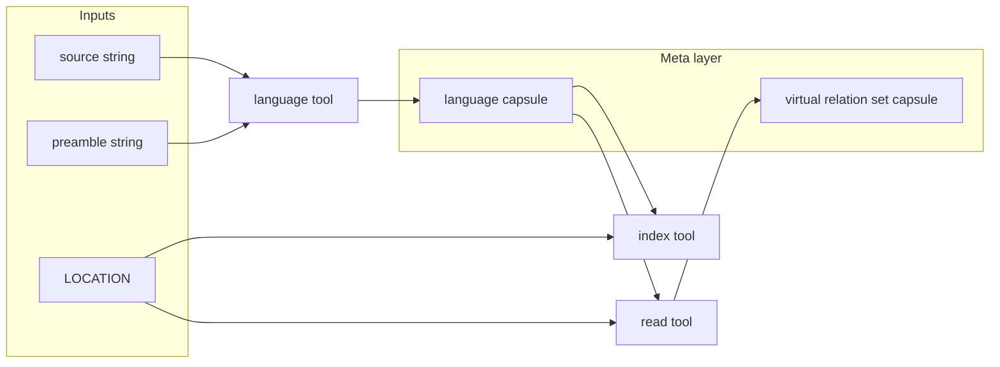

# RPL Meta-Programming Extension (MRPL) — Formal Specification

## 1. Status

This document defines an **extension** to RPL ([rpl.md](rpl.md)) and LRPL
([lrpl.md](lrpl.md)).

- Core RPL/LRPL hosts are **not required** to implement this extension.
- Hosts that claim support for this extension (for example, **RPL + Meta** or
  **MRPL**) **must** implement the grammar and semantics in this document for
  the features they expose.

Programs that use only core RPL/LRPL remain unchanged.

---

## 2. Why this extension exists

RPL can represent knowledge relationally, but not all useful knowledge needs to
be fully expanded into live RPL clauses.

This extension introduces **meta-variables** (`@name`) as references to
agent-known meaning that is:

- already structured,
- already interpretable,
- and often already specified in another formalism.

A meta-variable works as a **proxy belief**:

- it can participate in reasoning,
- it can be passed through tools,
- but it does not force full reification of its full source into the active
  program or chat context.

Primary goal: avoid context and state explosion when source material is already
well-specified elsewhere.

---

## 3. Relationship to base specs

All definitions in [rpl.md](rpl.md) and [lrpl.md](lrpl.md) apply unless this
document explicitly extends or specializes them.

- **Lazy tool dispatch** — Extension tools (`$language`, `$read`) follow LRPL
  lazy dispatch rules. A tool call does not execute until forward progress
  requires its result.
- **`$index`** — Core forms in LRPL remain valid. This extension adds a
  second-argument form where the second argument is a meta-variable.

---

## 4. Meta-variables

### 4.1 Syntax

A meta-variable is `@` immediately followed by `NAME`:

```
META-VAR = '@' NAME
NAME     = [a-z] [ a-z0-9\- ]*    -- as in rpl.md Appendix
```

### 4.2 Common `@` semantics across core and meta forms

Core RPL already uses `@` for abductive activation forms (`@when`, `@choose`,
`@distinct`, `@each`, `@for`). MRPL keeps that same meta-level intent for `@*`
forms: these refer to formally meaningful behavior without requiring full clause
materialization in the current program.

In other words:

- `@when(...)` and related abductive forms constrain when ordinary rules fire.
- `@lang`, `@rels`, and related `@*` handles refer to agent-known relational
  meaning that may remain virtual.
- Hosts may define additional `@*` meta-relational forms (for example
  `@rels(...)`) with explicit semantics, but those semantics are not required to
  be expanded into complete RPL clauses unless a downstream step demands it.

### 4.3 Meaning

A meta-variable denotes an **opaque, agent-managed handle** to a meaning-bearing
artifact. It is not an ordinary lvar binding and not a normal EDN value.

Think of it as:

- a handle to "what the agent understands this thing to mean",
- treated as relationally usable,
- without requiring the full source to be asserted as live RPL.

This allows reasoning over external or large artifacts as if they were RPL-like
knowledge, while keeping execution and context bounded.

This rule is stronger than "lazy expansion": for `@*` meta forms, non-reification
is the default and preferred mode, enabling references to artifacts that are not
compactly representable in RPL or are better kept in their native notation.

### 4.4 External formalisms and already-specified artifacts

Meta-variables are specifically useful when the source is already formal or
semi-formal and does not need immediate re-expression in RPL. Typical examples:

- SQL queries or schemas.
- Mermaid ERDs.
- RFC/specification documents.
- Markdown tables with explicit structure.
- JSON-LD and other self-describing relational formats.
- Large RPL or LRPL files that are known but not needed inline.
- Stable model-ground/domain knowledge that the host treats as structured.

These artifacts may be treated as **RPL-compatible referents** through
meta-variables without mandatory full grounding into active rules.

### 4.5 Unification and identity

Meta-variable unification is by **capsule identity**:

- Two meta-variables unify only if they refer to the same host-defined capsule.
- Alias and dedup rules are host-defined and must be documented by the host.
- A meta-variable does **not** unify with arbitrary literal/list/map/lvar values
  unless a host defines an explicit conversion extension.

### 4.6 Placement restrictions

`META-VAR` is valid only in specific positions:

- relation-call arguments (extension `ARG`),
- second argument of `$read`,
- second argument of `$index` when used as language reference,
- `^:result` target for `$language` and `$read`.

`META-VAR` is **not valid** as a collection element (list/set/map element).

### 4.7 Trace, chat, and `$json`

- Trace output should record completion plus a stable handle/digest reference,
  not full virtual artifact content.
- `$json(?x)` remains lvar-only per core semantics.
- `$json(@capsule)` is not defined by this extension unless a host adds a
  separate explicit extension.

### 4.8 Non-goals

This extension does not require:

- universal conversion of all external notations into explicit RPL clauses,
- materialization of all capsule internals into chat context,
- exposing full capsule internals in trace or tool output.

---

## 5. `$language`

`$language` creates a **language capsule**: a meta-level relational reading of a
language definition sourced from external material.

```
$language(?source, ?preamble) ^:result @lang
```

Arguments:

- `?source`: string (or lvar bound to string) identifying source location
  (path/URL/fragment).
- `?preamble`: string (or lvar bound to string) supplying guidance to the
  language-reading process.

Result:

- `^:result @lang` binds `@lang` to the resulting language capsule.

Semantics:

- The capsule is opaque.
- The host/model may derive it from prose, diagrams, formal fragments, or a mix.
- Portable programs should pass both arguments explicitly even if a host offers
  defaults.

Dispatch:

- Lazy, per LRPL rules.

---

## 6. `$read`

`$read` interprets a source artifact at `LOCATION` under a language capsule and
produces a virtual relation set handle.

```
$read(LOCATION, @lang) ^:result @rels
```

Where:

- `LOCATION` follows LRPL `$index` location rules (string path/URL/relation
  location form).
- `@lang` is a language capsule from `$language`.

Result:

- `@rels` names a capsule for the virtual relational reading.
- This is not equivalent to asserting live facts/rules into the current
  program.

Dispatch:

- Lazy, per LRPL rules.

---

## 7. `$index` extension (second argument = `META-VAR`)

Core LRPL `$index` forms remain unchanged. MRPL adds:

```
$index(LOCATION, @lang)
$index(SOURCE-RELATION(?a, $collection), @lang)
```

Second-argument disambiguation:

- String => core projection hint behavior.
- Meta-variable => language reference behavior.

With `@lang`:

- external data at `LOCATION` is interpreted in the frame of `@lang`,
- then core `$index` behavior applies for mapping/filtering/collection handling.

This extension does **not** add `^:result` to `$index`.

---

## 8. Usage guidance

Use meta-variables when:

- the source meaning is already reliable and structured,
- you need reasoning leverage, not full textual expansion,
- reification cost is high and inference needs are narrow.

Avoid meta-variables when:

- portable exactness requires explicit clause-level grounding now,
- host-specific capsule behavior would create unacceptable ambiguity.

Practical rule:

- treat meta-vars as semantic handles first,
- materialize only when downstream inference needs explicit clause-level detail.

---

## 9. Examples

Language capsule:

```rpl
my-lang(@lang) <- $language('my-lang.md#specification', 'The Mermaid diagram defines the language') ^:result @lang
```

Virtual reading under that language:

```rpl
% <- my-lang(@lang), $read('my-program.my-lang', @lang) ^:result @rels
```

Direct indexing under that language frame:

```rpl
% <- my-lang(@lang), $index('my-program.my-lang', @lang)
```

---

## 10. Grammar extensions

For extension hosts only. Unlisted nonterminals are inherited from base specs.

### 10.1 `ARG` extension

```
ARG             = VAR | LITERAL | COLLECTION | '_' | RELATION | META-VAR
META-VAR        = '@' NAME
```

Restriction:

- `META-VAR` is not a valid collection `ELEMENT`.

### 10.2 `$index` extension

```
INDEX-CALL         = '$index' '(' INDEX-LOC ')'
                   | '$index' '(' INDEX-LOC ',' STRING ')'
                   | '$index' '(' INDEX-LOC ',' META-VAR ')'
INDEX-LOC          = STRING | RELATION-WITH-AVAR
RELATION-WITH-AVAR = LABEL '(' [ INDEX-ARG [ ',' INDEX-ARG ]* ]? ')'
INDEX-ARG          = LVAR | ASYNC-VAR | LITERAL | '_'
```

### 10.3 `$read`

```
READ-CALL          = '$read' '(' INDEX-LOC ',' META-VAR ')'
```

### 10.4 `$language`

```
LANGUAGE-CALL      = '$language' '(' [ LANG-ARG [ ',' LANG-ARG ]? ]? ')'
LANG-ARG           = LVAR | STRING
```

### 10.5 `STDLIB`

```
STDLIB = '$index' | '$generate' | '$write' | '$json' | '$copy'
       | '$transform' | '$language' | '$read'
```

As in LRPL, `STDLIB` identifiers are reserved and cannot be user-defined
relation names.

---

## 11. Summary diagram


